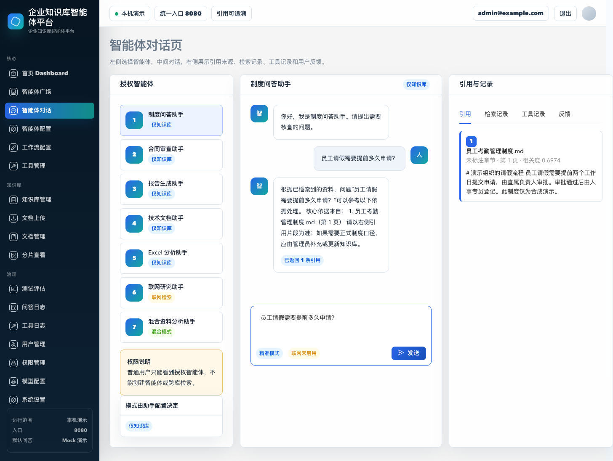
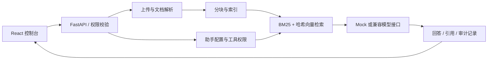

# Agentic Knowledge Workbench

**带权限、来源引用和工具调用记录的本地知识库应用。**

A local-first knowledge application with access control, traceable retrieval and configurable agent workflows.

Python · FastAPI · SQLAlchemy · React · TypeScript · Ant Design




截图来自本地运行的合成数据演示。更多实际检查见 [验证记录](docs/VALIDATION.md)。

## 项目解决什么问题

将“上传资料后提问”扩展为可以检查的完整流程：资料如何解析、哪些知识库可用、谁能使用某个助手、回答从哪里来、工具做了什么。项目重点是应用工程与可追溯性。

| 能力 | 实现与可查看的证据 |
| --- | --- |
| 文档处理 | 上传、解析、分块、入库和重新建索引；`backend/app/services/ingestion.py` |
| 混合检索 | BM25 与轻量哈希向量融合；`backend/app/rag/retriever.py` |
| 权限边界 | 管理角色、私有助手授权、工具权限；`backend/tests/test_real_system_flow.py` |
| 助手流程 | 知识库绑定、流程配置、引用、反馈与调用日志 |
| 可核对评测 | 对合成样例实际检索，计算文档 Hit@K 和 MRR；没有运行时显示“尚未测量” |



## 本地运行

需要 Python 3.12+、Node.js 22.12+。命令均从仓库根目录执行。默认 mock 模式不需要 GPU、模型下载或 API 额度。

```bash
python3 -m venv .venv
source .venv/bin/activate
python -m pip install -r backend/requirements.txt
cp .env.example .env
python scripts/seed_demo_data.py
python -m uvicorn app.main:app --app-dir backend --host 127.0.0.1 --port 8000
```

另开终端，从仓库根目录执行：

```bash
cd frontend
npm ci --ignore-scripts
npm run dev
```

打开 <http://127.0.0.1:8080>。演示管理员为 `admin@example.com`，密码 `ChangeMe123!`；普通用户为 `user@example.com`，密码 `User123456!`。这些是公开的合成演示账号，只用于本机试用。

建议演示顺序：登录 → 查看知识库与片段 → 打开制度助手提问“员工请假需要提前多久申请？” → 检查来源 → 运行检索评测 → 切换普通用户核对权限。

## 验证

```bash
PYTHONPATH=backend python -m pytest backend/tests -q
cd frontend
npm run build
```

详细指标口径、验证范围与限制见 [验证说明](docs/VALIDATION.md)。GitHub Actions 配置会在推送后执行相同的核心检查；本地通过不代表云端 CI 已运行。

## 实现边界

- 默认向量由轻量哈希方法生成，适合验证流程；未将其称为语义 embedding 模型。真实模型效果需要单独测量。
- mock 回答用于演示接线；没有据此提供真实 LLM 的准确率或生产容量结论。
- 样例只包含 3 篇虚构文档。Hit@K 不能替代引用忠实度、回答正确性或独立业务测试集。
- 本版是本机工程演示。公开部署前需替换演示身份、配置真实认证和安全边界，并做专项验证。

仅包含白名单源码与重新编写的合成样例。来源、依赖与许可说明见 [NOTICE](NOTICE.md)。
